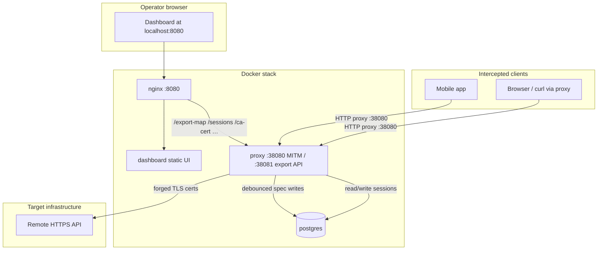

<div align="center">
  
  <br/>
  <p><b>Advanced API MITM Mapping & Reconnaissance Framework</b></p>
</div>

<p align="center">
  <a href="https://github.com/notfixingit3/shadowschema/actions"></a>
  <a href="https://github.com/notfixingit3/shadowschema/actions"></a>
  <a href="https://goreportcard.com/report/github.com/notfixingit3/shadowschema"></a>
  <a href="https://opensource.org/licenses/MIT"></a>
  <a href="https://github.com/sponsors/notfixingit3"></a>
</p>

---

## Contents

- [Overview](#overview)
- [Core Capabilities](#core-capabilities)
- [Quick Start (Docker)](#quick-start-docker)
- [Docker Deployment](#docker-deployment)
- [Architecture](#architecture)
- [Production Checklist](#production-checklist)
- [Hosted Deployment (Traefik / preview)](#hosted-deployment-traefik--preview)
- [Development from Source](#development-from-source)
- [Usage Examples](#usage-examples)
- [Spec Extraction](#spec-extraction)
- [Troubleshooting](#troubleshooting)
- [Testing](#testing)
- [Contributing](#contributing)
- [Legal Disclaimer](#legal-disclaimer)

## 👁️ Overview

**ShadowSchema** is a specialized, clandestine Man-in-the-Middle (MITM) proxy engineered in Go. Designed for advanced API reconnaissance, it silently intercepts target HTTP/HTTPS telemetry, deduces underlying JSON payloads, and programmatically reconstructs evolving OpenAPI 3.0 specifications on the fly.

Built for red teamers, security researchers, and systems architects who need to map undocumented endpoints in real-time.

## ⚡ Core Capabilities

- **Deep TLS Inspection:** Deploys a dynamically generated local Certificate Authority (CA) on startup, effortlessly bypassing HTTPS encryption to inspect application layers.
- **Heuristic Schema Inference:** Parses intercepted JSON telemetry recursively, performing automated type detection and bridging schema mutations iteratively.
- **Intelligent Routing Deduplication:** Aggregates variable routes through regex-driven pattern matching (UUIDs, IDs, Timestamps), drastically reducing map noise.
- **Shadow Domains Tracking:** Automatically detects when the target client communicates with out-of-scope APIs (like CDNs or third-party telemetry) and allows you to instantly add them to your interception perimeter.
- **Noise Cancellation:** Supports regex-based ignore rules to filter out static assets (`.png`, `.css`) or telemetry paths.
- **WebSocket & WSS Recon:** Detects `ws://` and `wss://` upgrade handshakes, deduplicates socket paths, captures `Sec-WebSocket-*` headers and query params, reassembles fragmented frames, logs ping/pong/close control traffic, and infers evolving JSON message schemas from live text/binary payloads.
- **Raw Payload Capture:** In addition to inferring the structural schema, ShadowSchema captures the last seen raw JSON payload for each endpoint so you can inspect actual live data alongside inferred types.
- **Dynamic Python Replay:** Includes a one-click exporter that parses an intercepted endpoint and its last seen payload directly into a functioning Python `requests` script to immediately replicate API calls.
- **SDK Generation:** One-click OpenAPI client SDK zips for Python, TypeScript, Go, and Rust via OpenAPI Generator.
- **Persistent Sessions:** Automatically stores mapped endpoints and active sessions in PostgreSQL (Docker) or SQLite (local dev), ensuring recon sessions survive shutdowns and restarts.
- **Progressive Web App (PWA):** Features a sleek, beautiful dashboard to manage target sessions, filter endpoints, and export specifications as JSON.

## 🚀 Quick Start (Docker)

The fastest path — no Go or Node.js required:

```bash
git clone https://github.com/notfixingit3/shadowschema.git
cd shadowschema
cp .env.example .env          # optional: pin stable vs beta images
docker compose pull
docker compose up -d
```

| Service | URL |
|---------|-----|
| Dashboard | http://localhost:8080 |
| MITM proxy | `127.0.0.1:38080` |
| Export API | http://localhost:38081 |

Download the MITM root CA from the dashboard (**🔒 CA Cert** in the header) or:

```bash
curl -fsS http://localhost:38081/ca-cert -o shadowschema-ca.crt
```

Live preview (Traefik): https://preview.example.internal

---

## 🐳 Docker Deployment

### Images

Pre-built images are published to [GitHub Container Registry](https://github.com/notfixingit3/shadowschema/pkgs/container/shadowschema):

| Image | Description |
|-------|-------------|
| `ghcr.io/notfixingit3/shadowschema` | MITM proxy + export API (`:38080`, `:38081`) |
| `ghcr.io/notfixingit3/shadowschema-dashboard` | Production dashboard (static Vite build + nginx on `:8080`) |

### Image tags

CI publishes tags on every push to `main` or `dev`, and on every git release tag:

| Tag | Published when | Best for |
|-----|----------------|----------|
| `:beta`, `:dev` | Push to `dev` | Bleeding-edge features; matches the development branch |
| `:latest`, `:main` | Push to `main` | Current stable line; moves when releases merge to `main` |
| `:v1.1.0`, `:v1.1.1`, … | Git tag on `main` | **Production pin** — immutable, known-good release |
| `:main-<sha>`, `:dev-<sha>` | Branch push | Debugging a specific CI build |

**Rule of thumb:** use `:beta` to try what's on `dev`, `:latest` to track stable merges, and `:vX.Y.Z` when you want a fixed version that won't change under you.

### Choosing stable vs beta

Both proxy and dashboard images must use the **same tag family**. Mixing `:beta` proxy with `:v1.1.0` dashboard will cause API mismatches.

**Beta (default in `.env.example`)** — tracks `dev`, gets new features first:

```bash
SHADOWSCHEMA_IMAGE=ghcr.io/notfixingit3/shadowschema:beta
SHADOWSCHEMA_DASHBOARD_IMAGE=ghcr.io/notfixingit3/shadowschema-dashboard:beta
```

**Pinned stable release** — recommended for production and hosted stacks:

```bash
SHADOWSCHEMA_IMAGE=ghcr.io/notfixingit3/shadowschema:v1.1.0
SHADOWSCHEMA_DASHBOARD_IMAGE=ghcr.io/notfixingit3/shadowschema-dashboard:v1.1.0
```

**Rolling stable (`:latest`)** — follows `main` without pinning to a semver tag:

```bash
SHADOWSCHEMA_IMAGE=ghcr.io/notfixingit3/shadowschema:latest
SHADOWSCHEMA_DASHBOARD_IMAGE=ghcr.io/notfixingit3/shadowschema-dashboard:latest
```

**One-off without a `.env` file** — pull and run a specific release:

```bash
SHADOWSCHEMA_IMAGE=ghcr.io/notfixingit3/shadowschema:v1.1.0 \
SHADOWSCHEMA_DASHBOARD_IMAGE=ghcr.io/notfixingit3/shadowschema-dashboard:v1.1.0 \
docker compose pull && docker compose up -d
```

Copy `.env.example` to `.env` and uncomment the block that matches your workflow. Root `docker-compose.yml` defaults to `:beta` when no `.env` is present.

### Stack layout

Local `docker compose` runs four services:

| Service | Role |
|---------|------|
| `postgres` | Session + spec persistence |
| `proxy` | MITM on `:38080`, export API on `:38081` |
| `dashboard` | Static UI (nginx, internal `:8080`) |
| `nginx` | Same-origin front on `localhost:8080` (proxies export API to the dashboard) |

**Volumes:**

| Volume | Contents |
|--------|----------|
| `shadowschema-postgres` | Mapped endpoints, sessions, specs |
| `shadowschema-certs` | MITM CA keypair (survives image updates) |

**Environment variables** (see `.env.example`):

| Variable | Default | Purpose |
|----------|---------|---------|
| `SHADOWSCHEMA_IMAGE` | `:beta` | Proxy image tag |
| `SHADOWSCHEMA_DASHBOARD_IMAGE` | `:beta` | Dashboard image tag |
| `POSTGRES_USER` / `POSTGRES_PASSWORD` / `POSTGRES_DB` | `shadowschema` | Postgres credentials |
| `SHADOWSCHEMA_SAVE_DEBOUNCE_MS` | `2000` | Milliseconds between spec DB writes (raise for heavy browsing) |

### Architecture

Traffic splits into two paths: **interception** (clients through the MITM proxy) and **dashboard** (your browser through nginx). Both paths share the same Postgres-backed session store.



**Local ports:** `:8080` dashboard (nginx), `:38080` MITM proxy, `:38081` export API (also proxied through nginx for same-origin dashboard requests). Hosted preview stacks expose only the dashboard via Traefik; the MITM proxy stays internal unless you deliberately publish `:38080`.

### Production Checklist

Before pointing real recon traffic at a hosted or shared stack:

- [ ] **Pin immutable tags** — use `:vX.Y.Z` on both images, not `:beta` or `:latest`, so deploys are predictable.
- [ ] **Set a strong `POSTGRES_PASSWORD`** — change the default in `.env`; compose rebuilds `DATABASE_URL` for the proxy automatically.
- [ ] **Keep `:38080` off the public internet** — the MITM proxy should only be reachable from clients you control (lab network, VPN, local machine). The dashboard can be public; the proxy should not.
- [ ] **Back up `shadowschema-postgres`** — mapped endpoints and sessions live in this volume. CA material is in `shadowschema-certs` (back that up too if you need consistent forged certs across rebuilds).
- [ ] **Distribute the CA deliberately** — only install `shadowschema-ca.crt` on devices under test; remove it when the engagement ends.
- [ ] **Match proxy and dashboard tags** — verify with `docker inspect` after every pull (see [Updating and rolling back](#updating-and-rolling-back)).
- [ ] **Document your active session targets** — endpoints only populate for domains in the active session's target list.

### Updating and rolling back

**Pull the tag currently in your `.env`:**

```bash
docker compose pull && docker compose up -d
```

**Switch from beta to stable** — edit `.env`, then:

```bash
# .env now pins v1.1.0
docker compose pull && docker compose up -d
```

Postgres data and CA certs are preserved across image changes. Only the application binaries change.

**Roll back** — set the previous `:vX.Y.Z` in `.env` and run `docker compose pull && docker compose up -d` again.

**Check what's running:**

```bash
docker inspect shadowschema-proxy --format '{{.Config.Image}}'
docker inspect shadowschema-dashboard --format '{{.Config.Image}}'
```

### CA certificate

Install the MITM root CA so clients trust intercepted HTTPS:

```bash
# Export API (works while stack is up)
curl -fsS http://localhost:38081/ca-cert -o shadowschema-ca.crt

# Or copy from the running container
docker cp shadowschema-proxy:/app/certs/ca.crt ./ca.crt
```

> **Migrating from pre-beta.6:** Older stacks used a `shadowschema-data` SQLite volume. Beta.6+ requires Postgres — the first deploy creates a fresh database. CA certs in `shadowschema-certs` are preserved.

---

## 🌐 Hosted Deployment (Traefik / preview)

For hosting behind Traefik on the `preview.me` network, use `deploy/preview/`. The service layout matches local Docker (postgres, proxy, dashboard, nginx) with Traefik labels on nginx instead of a published host port.

**First-time setup:**

```bash
cd deploy/preview
cp .env.example .env
# Set POSTGRES_PASSWORD in .env before going live
# Pin stable tags for production (see .env.example)
docker compose pull
docker compose up -d
```

**Updates** after a new `dev` push or release tag:

```bash
cd /opt/stacks/shadowschema_preview   # or your checkout's deploy/preview
docker compose pull && docker compose up -d
```

Live preview: https://preview.example.internal

---

## 🛠️ Development from Source

**Contributors** need Go 1.21+ and Node.js 20+ (see `CONTRIBUTING.md`). Local `go run` uses SQLite; Docker uses PostgreSQL.

```bash
# MITM engine (SQLite at ./shadowschema.db when DATABASE_URL is unset)
go run main.go
```

```bash
# Dashboard dev server (proxies export API to :38081)
cd dashboard
npm install
npm run dev
```

Navigate to `http://localhost:5173`. From the dashboard you can create Target Sessions, manage noise cancellation rules, explore Shadow Domains, and inspect WebSocket endpoints.

**Privileges:** Root CA (`certs/ca.crt`) installation capabilities to satisfy client-side SSL validation constraints.

**Build images locally:**

```bash
docker build -t shadowschema:local .
docker build -f Dockerfile.dashboard -t shadowschema-dashboard:local .
SHADOWSCHEMA_IMAGE=shadowschema:local SHADOWSCHEMA_DASHBOARD_IMAGE=shadowschema-dashboard:local docker compose up -d
```

---

## 🎮 Usage Examples

### 1. Intercepting a Mobile App (iOS/Android)
1. Start ShadowSchema and navigate to the dashboard to create a new session targeting `api.targetapp.com`.
2. Transfer `certs/ca.crt` to your mobile device and install it as a trusted Root CA.
3. Configure your mobile device's Wi-Fi settings to use your computer's local IP (e.g., `192.168.1.10:38080`) as an HTTP Proxy.
4. Open the app! The dashboard will instantly populate with mapped endpoints as you navigate through it.

### 2. Intercepting cURL Requests
You can route CLI tools through the proxy using environment variables. The `-k` flag is required if you haven't installed the CA cert to your system's trust store.
```bash
export http_proxy=http://127.0.0.1:38080
export https_proxy=http://127.0.0.1:38080

# Assuming your active session targets "example.com"
curl -k https://example.com/api/v1/users
```

### 3. Intercepting a Browser (Firefox Developer Edition)
Firefox Developer Edition is excellent for API recon because it has its own independent certificate store and proxy settings, keeping your daily browsing unaffected.

**Configure the Proxy:**
1. Open Firefox Developer Edition and go to **Settings** -> **General** -> **Network Settings** (at the very bottom).
2. Select **Manual proxy configuration**.
3. Set **HTTP Proxy** to `127.0.0.1` and **Port** to `38080`.
4. Check **Also use this proxy for HTTPS**.
5. Click **OK**.

**Trust the ShadowSchema CA:**
1. In Settings, go to **Privacy & Security**.
2. Scroll down to the **Certificates** section and click **View Certificates...**.
3. Go to the **Authorities** tab and click **Import...**.
4. Select the `certs/ca.crt` file generated in your ShadowSchema directory.
5. Check **Trust this CA to identify websites** and click **OK**.

Now, traffic from Firefox Developer Edition will seamlessly route through ShadowSchema!

### 🔑 Trust Provisioning (System-Wide)

Upon initial launch, ShadowSchema will forge a fresh RSA keypair and self-signed Certificate Authority within the `certs/` directory. 
To achieve seamless HTTPS interception without triggering `ERR_CERT_AUTHORITY_INVALID` anomalies:
1. Locate `certs/ca.crt`.
2. Inject it into your operating system's root trust store or browser authority list.

## 📡 Spec Extraction

While the proxy actively intercepts and builds the map, you can extract the live OpenAPI specification via the dashboard's "Export JSON" button, or hit the extraction node directly:

```bash
# Pull the live schema payload
curl -s http://localhost:38081/export-map
```

Alternatively, dispatch a `Ctrl+C` interrupt. ShadowSchema will catch the signal, perform a graceful shutdown, and dump the final footprint directly to `openapi.json` in your current working directory.

### Export API Endpoints

The background export server on `:38081` powers the dashboard and CLI tooling:

| Endpoint | Method | Description |
|----------|--------|-------------|
| `/export-map` | GET | Live OpenAPI spec (JSON or `?format=yaml`) |
| `/vault` | GET | Captured auth credentials |
| `/discovered` | GET | Out-of-scope domains seen via CONNECT |
| `/sessions` | GET, POST | List or create recon sessions |
| `/sessions/switch` | POST | Activate a saved session |
| `/sessions/delete` | POST | Delete a session |
| `/sessions/add-target` | POST | Append a domain to the active target list |
| `/generate-sdk` | POST | Generate a Python, TypeScript, Go, or Rust SDK zip |
| `/ca-cert` | GET | Download the MITM root CA (`shadowschema-ca.crt`) |

## 🔧 Troubleshooting

| Symptom | Likely cause | Fix |
|---------|--------------|-----|
| `ERR_CERT_AUTHORITY_INVALID` / `SEC_ERROR_UNKNOWN_ISSUER` in browser | MITM CA not trusted | Download via **🔒 CA Cert** or `GET /ca-cert`, import into the browser or OS trust store (see [Trust Provisioning](#-trust-provisioning-system-wide) under Usage Examples) |
| Dashboard loads but endpoint list is empty | No traffic through proxy, wrong session, or domain not in target list | Confirm client uses `127.0.0.1:38080` (or host IP); create/switch session in dashboard; add target domain or promote from Shadow Domains |
| `curl: (7) Failed to connect` to `:38081` | Proxy container down or port not published | `docker compose ps`; ensure `shadowschema-proxy` is healthy and ports `38080`/`38081` are mapped |
| Dashboard API errors / blank data after image update | Proxy and dashboard image tags mismatched | Set the same tag family in `.env` for both images, then `docker compose pull && docker compose up -d` |
| Proxy container exits / `connection refused` to Postgres | Postgres not healthy or wrong credentials | `docker compose logs postgres proxy`; verify `POSTGRES_*` in `.env` matches the existing volume (changing password on an initialized volume requires manual DB fix or a fresh volume) |
| Interception works but UI feels sluggish | Heavy session with frequent spec writes | Raise `SHADOWSCHEMA_SAVE_DEBOUNCE_MS` (e.g. `5000`) in `.env` and recreate the proxy container |
| `openapi.json` empty after Ctrl+C | No JSON responses captured yet | Generate traffic against in-scope HTTPS endpoints first; noise rules may be filtering paths |
| Hosted dashboard works but cannot intercept remotely | MITM port not exposed by design | Proxy must be reachable from the test device — use VPN, SSH tunnel, or lab network access to `:38080`; do not expose it unauthenticated on the public internet |

**Logs:**

```bash
docker compose logs -f proxy
docker compose logs -f postgres
docker compose logs -f nginx
```

**Reset session data** (destructive — wipes mapped endpoints):

```bash
docker compose down
docker volume rm shadowschema-postgres   # only if you intend to start fresh
docker compose up -d
```

## 🧪 Testing

ShadowSchema ships with unit and integration tests across the proxy engine, export API, and schema inference pipeline.

```bash
# Full suite (uses in-memory SQLite via pure-Go driver)
go test ./...

# Static analysis (enforced in CI)
go vet ./...
gosec ./...
```

Coverage is strongest in `internal/router` (100%), `internal/spec` (~73%), and `main` proxy integration tests. SDK generation tests skip automatically when `npx` is unavailable.

## 🤝 Contributing

We welcome pull requests! See `CONTRIBUTING.md` for our guidelines, and `THIRDPARTY.md` for information on our open-source dependencies. Please ensure you run `go vet ./...` and `gosec ./...` before submitting your changes.

## ⚖️ Legal Disclaimer

**For Educational and Authorized Use Only.** ShadowSchema is designed exclusively for security research, systems architecture analysis, and debugging on networks and APIs where you have explicit authorization to do so. The author assumes no liability and is not responsible for any misuse, damage, or unauthorized access caused by this software. Use responsibly and abide by all applicable local and international laws.

## 🛋️ Origin Story

*Why build this?* I suffered a back injury a while back, which means I now spend a lot of time laying around with my laptop. Figuring out undocumented APIs from the couch sounded like a fun way to pass the time, so here we are!

---
<div align="center">
<i>"Visibility is the first step to understanding."</i>
</div>